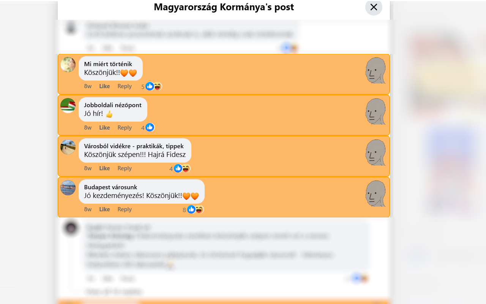
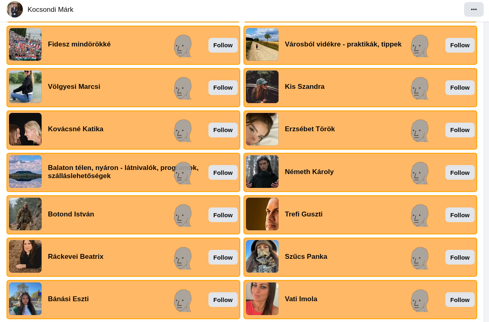
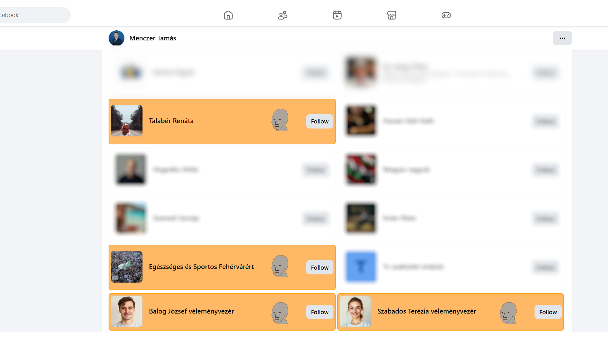
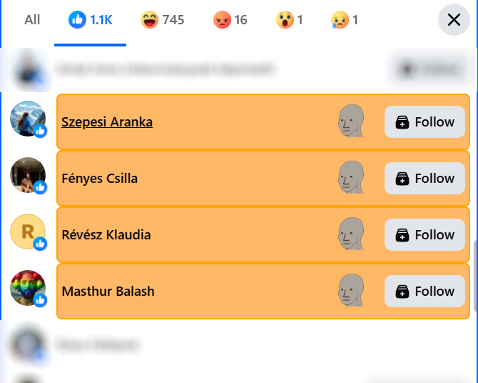
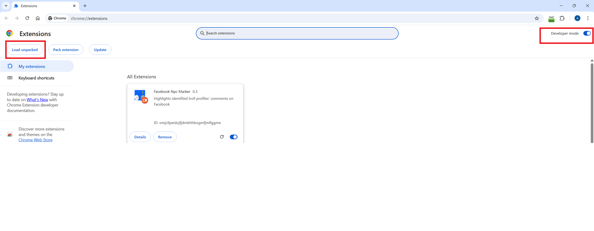

# Facebook NPC Marker
Chrome plugin that marks identified troll profiles' activity on Facebook.

# Screenshots
Comments marking

Followers marking

Reactions marking

# Assets
The plugin gets the profile ids from the `assets/profiles.json`.
The initial dataset is fetched from publicly available articles by [Telex](https://telex.hu/techtud/2026/03/09/mutatjuk-a-fideszes-kamuprofil-halozat-mind-az-1198-tagjat)

New 0.3 version also includes updated datasource based on recent [article](https://telex.hu/techtud/2026/03/19/mutatjuk-a-fideszes-politikusok-marcius-15-i-ukran-zaszlos-posztjait-lajkokkal-kihangosito-1954-kamuprofilt)

# Installation

The plugin can be installed in two ways:

## Install from Chrome Plugin store

Easiest way to install is to use Chrome's Web Store, located [here](https://chromewebstore.google.com/detail/facebook-npc-marker/fekdebmoeljibibofalgkfghmbjipnif).  The newest version of the application might be published later here, due to the lengthy review process.

## Install manually

Alternatively, you can install the latest version by downloading the zip file in releases, unpacking it and loading the unpacked plugin' src folder while the developer mode is enabled in your Chrome's extension page.

Here, the unpacked folder with the content.js and manifest.json must be selected.

# Known issues

Comment hightlighting only works in Facebook's "English" language settings. This was fixed in version 0.5
